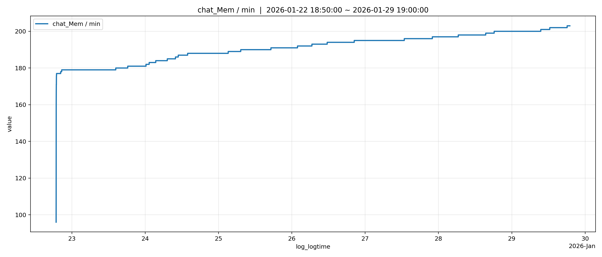
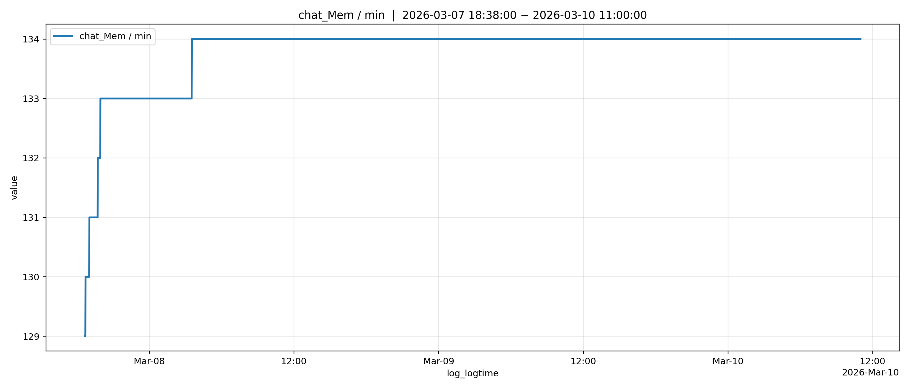
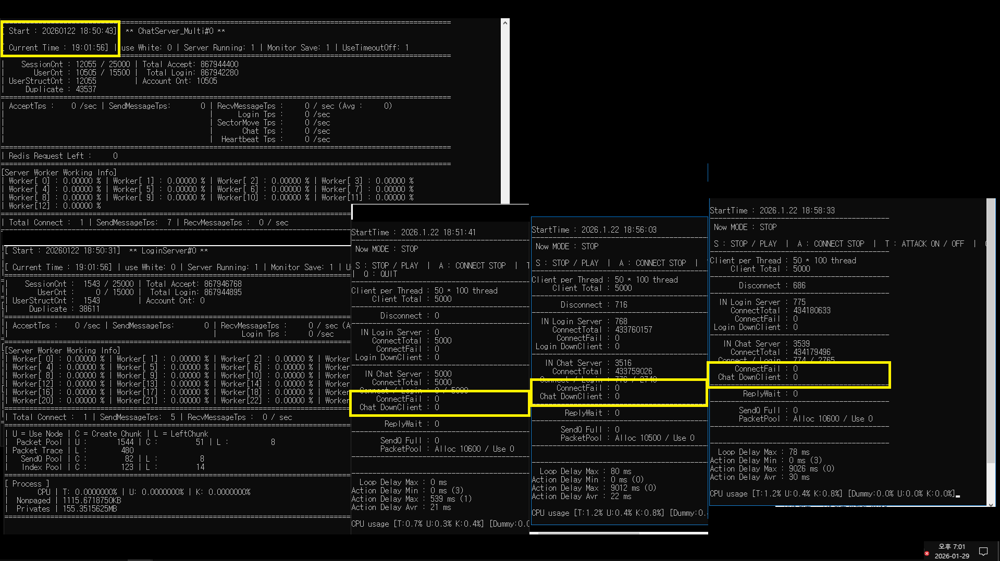
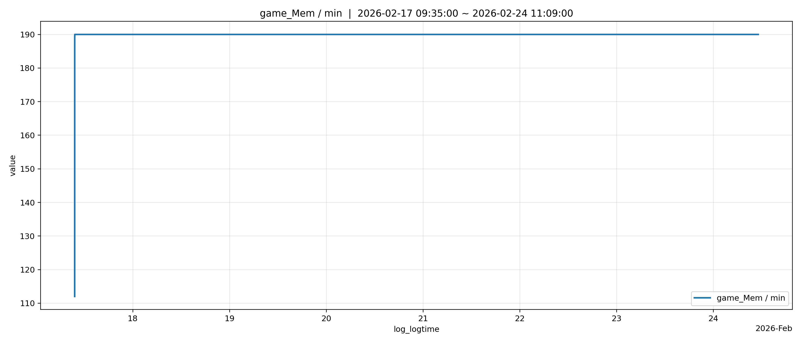
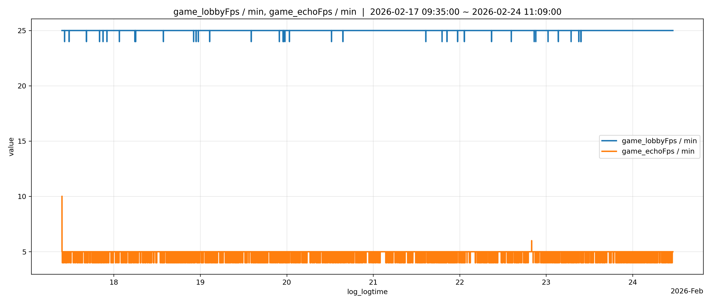

# 서버 안전성 테스트
## 1. C++ 멀티 스레드 채팅 서버 시스템 테스트

### 목적


- 로그인 서버, 채팅 서버, Redis, MySQL 기능들이 정상적으로 동작 하는지 확인
- 잘못된 판단으로 다른 클라이언트를 끊는 경우가 있는지 확인
- 비정상 유저를 잘 끊어내는지 확인
.  - 로그인 서버를 거치지 않고 채팅 서버로 오는 경우 (Redis세션 키 불일치)
   - 이상한 메시지를 보내는 경우 (파싱 결과 비정상 메시지)
   - 연결만 하는 경우 (타임 아웃 대상)
- 세션 생명주기에 문제는 없는지 확인

### 테스트 환경 

| 항목 | 내용 |
|--|--|
| OS | Windows Server 2019 |
| CPU | Intel® Xeon® E5-2680 v4 <br> 14Core 28 Thread <br> 2.40GHz ~ 3.30GHz|
| Network | LAN |
| User | 15000 |
| Test Duration | 7 일|

### 테스트 결과

| 항목 | 내용 |
| --- | --- | 
| Down Client | 0 |
| Session Left | 0 |
| Total Accept | 867,944,400 |
| Accept Tps | 1200 ~ 1600 |
| Recv Tps | 16000 ~ 17000 |
| Send Tps | 290000 ~ 300000 |
| CPU | 13 ~ 16 % |

### 메모리(Private Bytes) 사용량 [MB]
- 분석 
  - 첫 일주일 테스트에서 메모리 사용량은 180MB -> 200MB로 증가 하는 것 처럼 보였습니다. ([1] 번 그림)
  - 다만 실제 서버 종료 시 풀 누수는 없었습니다. 
  - 원인 분석 결과 센드 큐 공용풀의 최대 제한이 실제 사용량 보다 낮게 설정해 LFH의 영역에서 free / new가 반복적으로 발생하고 있었습니다.
  - 또한 노드 단위 반환 스레드와 생성 스레드가 달라 페이지 내부에 사용중 / 미사용 슬롯이 섞이며 페이지 단위의 반환이 발생하지 않는 현상이 발생했습니다.
  - 이러한 이유로 전체적인 Private Bytes가 점진증가 한 것으로 판단 하였습니다.
  - 따라서 공용 풀 최대 제한을 충분히 늘린 후 동일한 조건에서 재검증을 수행하였고,
  3일간의 테스트 동안 메모리 사용이 안정적으로 유지되는 것을 확인했습니다. 

- [1] 일주일 테스트의 시간에 따른 Private Bytes 변화[MB] (메모리 풀 최대 제한 설정)

- [2] 3일 추가 테스트의 시간에 따른 Private Bytes 변화[MB] (메모리 풀 최대 제한 해제)


### 정지 스크린샷



## 2. Zone기능을 활용한 기능 테스트
### 목적


- Zone이 정상적으로 틱마다 동작하는지 확인
- Zone의 핵심 함수 Move, Enter, Leave가 정상 동작하는지 확인
- 잘못된 판단으로 다른 클라이언트를 끊는 경우가 있는지 확인
- 세션 생명주기에 문제는 없는지 확인

### 세팅

- Zone은 두개를 사용 (Lobby, Echo)
- Lobby는 로그인 대기를 하는 공간
- Echo는 에코 컨텐츠 공간
- 처음 입장한 유저는 Lobby를 거쳐 Echo로 이동
- 전체 유저 관리는 Lobby에서 함
```
           +---------+  ---Move---> +--------+  
Enter ->   |  Lobby  |              |  Echo  |
           +---------+  <--Remove-- +--------+
                           AccountNo
                           (About Leave User)
```
### 테스트 환경 

| 항목 | 내용 |
|--|--|
| OS | Windows Server 2019 |
| CPU | Intel® Xeon® E5-2680 v4 <br> 14Core 28 Thread <br> 2.40GHz ~ 3.30GHz|
| Network | LAN |
| User | 5000 |
| Test Duration | 7 일|

### 테스트 결과

| 항목 | 내용 |
| --- | --- | 
| Down Client | 0 |
| Session Left | 0 |
| Total Accept | 937,061,456 |
| Accept Tps | 1200 ~ 1600 |
| Recv Tps | 1,400,000 ~ 1,600,000 |
| Send Tps | 1,400,000 ~ 1,600,000 |
| CPU | 10 ~ 13 % |


### 메모리 사용량 (Private Bytes [MB])
- 시간에 따른 메모리 사용량[MB]


### fps (Lobby: 24 ~ 25fps / Echo: 5 ~ 7 fps)
- 시간에 따른 각 Zone(Lobby, Echo)의 fps (초당 Update횟수)


